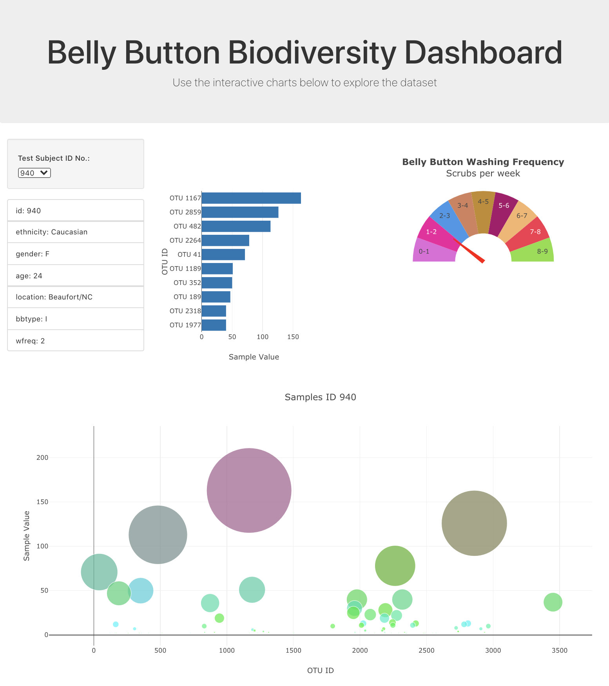
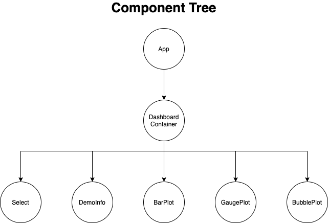
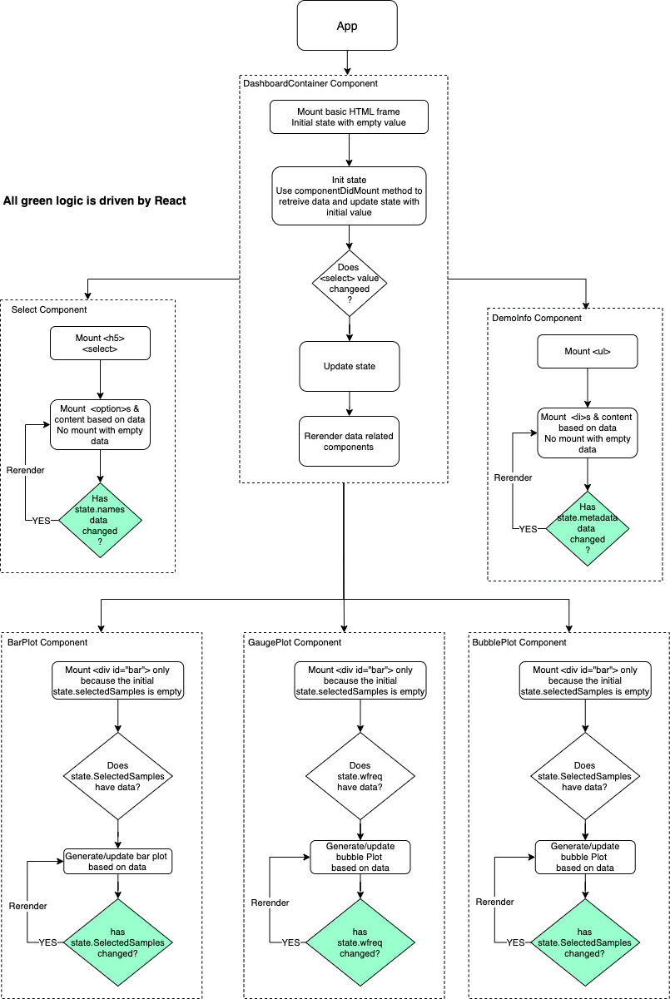

# Project introduction

This project use React, Plotly.js, Bootstrap to build a interactive dashborad webpage
The webpage is published at "https://simon-xu-lan.github.io/REACT-Interactive-Visualization-and-Dashboards/"

# Code structure

## 1.Component Tree

- The following chart shows the structure of the component tree.
- App is the root component.
- DachboardContainer is rendered by App. it is a class component. Data is in the state. When the data in state change, it rerender/update its child components
- The following 5 components are children of DashboardContainer and are rendered by DashboardContainer. They are functional components.
  - Select, DemoInfo, BarPlot, GaugePlot, BubblePlot

## 2. Flow Chart

# What I learned

- When use data in component, make sure to check if the data is empty or not, otherwise error pop up
  - if data is empty, mount HTML frame only
  - else, generate plot based on data
- React has build logic to check the state change and re-render the state data related components
- Plotly.newPlot method must has the related 
 with id mounted first, otherwise the plot won't be build.

  - The state data is empty When React in the first mounting stage, so React just mount HTML frame to later use.

- Use local data file such as "samples.json"
  - Make sure use the server path not filesystem path
    - Put the data file under public folder
    - Use the server path "/samples.json"
    - Don't use the file system path: "samples.json"
  - However, the above solution works well under development mode/local computer. it doesn't work after it was deployed to github.

# Question

- Why does the data file not work?
- Why API path not work?
  - The api call issue has been fixed by adding Flask cors
  - https://flask-cors.readthedocs.io/en/latest/
